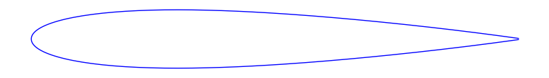
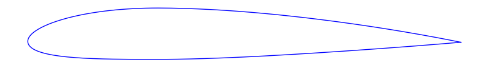
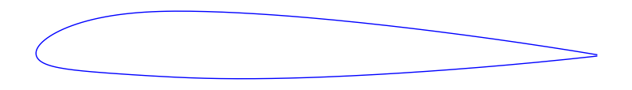
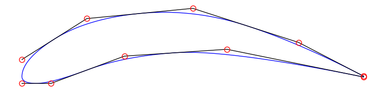
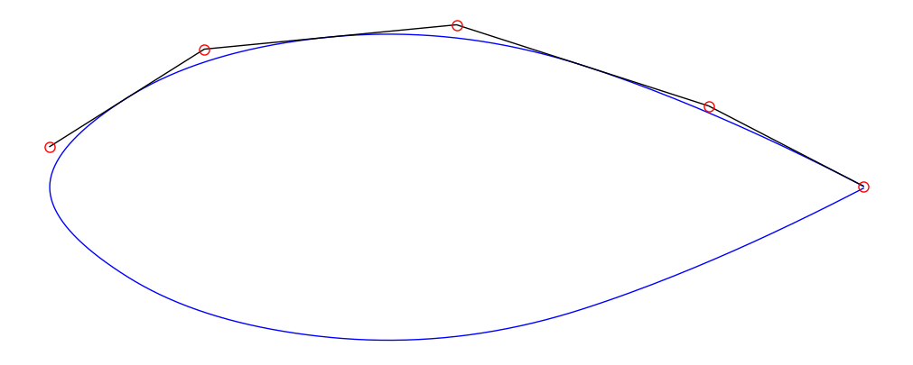

# FoilLib

[](https://pypi.org/project/pyfoobar/)
[](https://pypi.org/project/foillib/)
[](https://github.com/nathanrooy/foillib/actions)
[](https://codecov.io/gh/nathanrooy/foillib)
[](https://github.com/psf/black)

I finally started to consolidate all my airfoil scripts...


## Installation


To use, install via [PyPI](https://pypi.org/):


```sh
pip install foillib
```


Or install directly from this repo:
```sh
pip install git+https://github.com/nathanrooy/foillib
````


## Opinions and other things to keep in mind


- All airfoils are dimensionless and have a chord = 1.
- The leading edge is at (0,0).
- The trailing edge is at (1, 0).
- Airfoil coordinates start at the trailing edge and move along the top surface towards the leading edge. Once the leading edge has been reached, coordinates follow the bottom surface back to the trailing edge.


## Parameters shared across all airfoil types:


- `npts` (optional, int): The number of points along the chord. Because the leading edge is defined by a singular point at (0,0) the total points is actually (2*npts+1). Default: `npts=100`.
- `spacing_method` (optional): The distribution of points along the chord can either be `"equal"` or `"cosine"`. Default: `spacing_method="cosine"`.


## NACA Airfoils


- `digits` (required, string): The NACA 4 or 5 series designation.
- `finite_te` (optional, boolean):  Specifies whether the trailing edge should have a thickness or not. By default, the trailing edge will include a non-zero thickness: `finite_te=True`.


### 4-Series

A basic symmetrical NACA airfoil:

```Python
import foillib as fl
x, y = fl.naca("0012")
```



A cambered NACA airfoil with a non-finite trailing edge:

```Python
import foillib as fl
x, y = fl.naca("2312", finite_te=False)
```



### 5-Series


Supports non-reflexed airfoils from `210` through `250` and non-reflexed airfoils from `221` through `251`.


```Python
import foillib as fl
x, y = fl.naca("24012")
```





## Bezier Airfoils

These airfoils are composed of two quadratic Piecewise (composite) Bezier curves joined at the leading edge with G1 (tangent) continuity.


- `cps_top` (required, list[tuple]): A list of (x, y) tuples representing control points for the top surface. Control points should be specified from the leading edge to the trailing edge. Because of the quadratic definition, a minimum of at least two control points are required.
- `cps_bot` (optional): If no values were provided, by default the values for `cps_top` will be mirrored resulting in a symmetrical airfoil.
- `cps_le` (required, list[float]): At least one float value is required. If two values are specified, the first represents the leading edge radius along the top surface and the second for the bottom surface. The term "radius" is not actually a true radius but simply the y-coordinate value of the first Bezier control point(s) from the leading edge (the G1 continuity constraint forces the x-coordinates to zero).
- `te` (optional, float): Specify the total trailing edge thickness. Default: `te=0.00252`.


Because I use this extensively for optimization, I chose speed over stability. This means several edge cases exist:


- Perfectly vertical Bezier segments will cause multiple roots to exist when solving for chord location. This will result in either poorly defined geometry or a failed airfoil. With that said, if you need something like a Gurney flap, that geometry should be added in a subsequent operation.
- No surface quality checks are performed. Intersections between the top and bottom surfaces are possible if poorly positioned control points are specified.


```Python
import foillib as fl

# control points specified from LE -> TE
cps_top = [(0.19, 0.17), (0.5, 0.2), (0.81, 0.1)]
cps_bot = [(0.085, -0.02), (0.3, 0.06), (0.6, 0.08)]
cps_le  = [0.05, 0.02]

x, y = fl.bezier(cps_le, cps_top, cps_bot)
```

Which will produce the following:





As stated previously, if a symmetrical airfoil is desired, simply don't specify `cps_bot` or a second point in `cps_le`:


```Python
import foillib as fl

cps_top = [(0.19, 0.17), (0.5, 0.2), (0.81, 0.1)]
cps_le  = [0.05]

x, y = fl.bezier(cps_le, cps_top)
```




## B-Spline
Maybe later…


